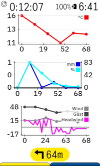

# Karoo Headwind Extension

This extension for Karoo devices adds a graphical data field that shows the current headwind direction and speed relative to the riding direction.

Compatible with Karoo 2 and Karoo 3 devices.

## Installation

This extension is available from the extension library on your Karoo device. Find more information on extensions in the [Hammerhead FAQ](https://support.hammerhead.io/hc/en-us/articles/34676015530907-Karoo-OS-Extensions-Library).

## Usage

After installing this app on your Karoo and opening it once from the main menu, you can add the following new data fields to your data pages:

- Headwind (graphical, 1x1 field): Shows the headwind direction and speed as a circle with a triangular direction indicator. The speed is shown at the center in your set unit of measurement (default is kilometers per hour if you have set up metric units in your Karoo, otherwise miles per hour). Both direction and speed are relative to the current riding direction by default, i. e., riding directly into a wind of 20 km/h will show a headwind speed of 20 km/h, while riding in the same direction will show -20 km/h.
- Tailwind with riding speed (graphical, 1x1 field): Shows an arrow indicating the current headwind direction next to a label reading your current speed and the speed of the tailwind. If you ride against a headwind of 5 mph, it will show "-5". If you ride in the same direction of a 5 mph wind, it will read "+5". Text and arrow are colored based on the tailwind speed, with red indicating a strong headwind and green indicating a strong tailwind.
- Wind direction and speed (graphical, 1x1 field): Similar to the tailwind data field, but shows the absolute wind speed and gust speed instead. The "circular" variant uses the same circular graphics as the headwind indicator instead.
- Wind forecast / Temperature Forecast / Precipitation forecast (graphical, 2x1 field): Line graphs showing the forecasted wind speeds, temperature or precipitation for the next 12 hours if no route is loaded. If a route is loaded, forecasts along the route will be used instead of the current location.
- Headwind forecast (graphical, 2x1 field): Shows the forecasted headwind speed if a route is loaded.
- Weather forecast (graphical, 2x1 field): Shows three columns indicating the current weather conditions (sunny, cloudy, ...), wind direction, precipitation and temperature forecasted for the next three hours. Tap on this widget to cycle through the 12 hour forecast. If you have a route loaded, the forecast widget will show the forecasted weather along points of the route, with an estimated traveled distance per hour of 20 km / 12 miles by default. If placed in a 1x1 datafield, only the current weather conditions are shown.
- Relative grade (numerical): Shows the relative grade. The relative grade is calculated by estimating the force of the headwind, and then calculating the gradient you would need to ride at to experience this resistance if there was no wind. Example: If you are riding on an actual gradient of 2 %, face a headwind of 18 km/h while riding at 29 km/h, the relative grade will be shown as 5.2 % (with 3.2 % added to the actual grade due to the headwind).
- Relative elevation gain (numerical): Shows the relative elegation gain. The relative elevation gain is calculated using the relative grade and is an estimation of how much climbing would have been equivalent to the headwind you faced during the ride.
- Resistance forces (graphical, 2x1 field): Shows a graphical representation of the different forces you have to overcome while riding, including gravity (actual gradient), rolling resistance (based on speed and weight), aerodynamic drag (based on speed) and wind resistance (based on headwind speed). The app reads your weight from your karoo user profile and uses rough estimates for CdA and Crr.
- Additionally, data fields that only show the current data value for headwind speed, humidity, cloud cover, absolute wind speed, absolute wind gust speed, absolute wind direction, rainfall and surface pressure can be added if desired.

The app can use OpenMeteo or OpenWeatherMap as providers for live weather data.

- OpenMeteo is the default provider and does not require any configuration. Wind speed will be reported in km/h if your karoo is set to metric units or mph if set to imperial.
- OpenWeatherMap can provide more accurate data for some locations. Forecasts along the loaded route are not available using OpenWeatherMap. OpenWeatherMap is free for personal use, but you need to register at https://openweathermap.org/home/sign_in and obtain a one call API key (e. g. by subscribing to "One Call API 3.0" from the [pricing page](https://openweathermap.org/price)). You can enter your API key in the app settings. Please note that it can take a few hours before OpenWeatherMap enables the key. You can check if your key is enabled by entering it in the app settings and pressing "Test API Key". Wind speed will be reported in km/h if your Karoo is set to metric units and miles per hour if set to imperial.

The app will automatically attempt to download weather data from the selected data provider once your device has acquired a GPS fix. Your location is rounded to approximately three kilometers to maintain privacy.
New weather data is downloaded when you ride more than three kilometers from the location where the weather data was downloaded for or after one hour at the latest.
If the app cannot connect to the weather service, it will retry the download every minute. Downloading weather data should work on Karoo 2 if you have a SIM card inserted or on Karoo 3 via your phone's internet connection if you have the Karoo companion app installed.

## Credits

- Icons are from [boxicons.com](https://boxicons.com) ([MIT-licensed](icon_credits.txt)) and the [Google Noto Color Emoji font](https://fonts.google.com/noto/specimen/Noto+Color+Emoji) (SIL Open Font License 1.1)
- Made possible by the generous usage terms of [open-meteo.com](https://open-meteo.com)
- Interfaces with [openweathermap.org](https://openweathermap.org)
- Uses [karoo-ext](https://github.com/hammerheadnav/karoo-ext) (Apache2-licensed)

## Extension Developers: Headwind Data Type

If the user has installed the headwind extension on his karoo, you can stream the headwind data type from other extensions via `karoo-ext`.
Use data type id `TYPE_EXT::karoo-headwind::TYPE_ID` with `TYPE_ID` being one of `headwind`, `windDirection`, `headwindSpeed`, `windSpeed` etc.

- The `headwind` datatype contains a single field that either represents an error code or the *relative* wind direction. A `-1.0` indicates missing gps receiption, `-2.0` no weather data, `-3.0` that the headwind extension
has not been set up. Otherwise, the value is the headwind direction in degrees.
- The `windDirection` datatype contains a single field with the *absolute* wind direction in degrees (so 0 = North, 90 = East etc.)
- The `headwindSpeed` datatype contains a single field that contains the *relative*  headwind speed in meters per second.
- The `windSpeed` datatype contains a single field that contains the *absolute* wind speed in meters per second.
- Other datatypes like `windGusts` etc. are also available, see [extension_info.xml](https://github.com/timklge/karoo-headwind/blob/master/app/src/main/res/xml/extension_info.xml)
